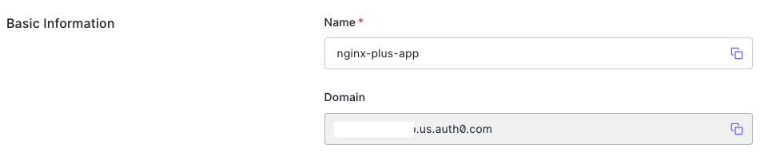

# How To Set Up NGINX Plus OIDC for Auth0 Integration

Take the following steps to set up NGINX Plus as the OpenID Connect relying party that runs.

## Configure NGINX OpenID Connect

1. Clone the [nginx-openid-connect/nginx-oidc-auth0](git@github.com:nginx-openid-connect/nginx-oidc-v1-auth0.git) GitHub repository, or download the repo files.

   ```bash
   git clone https://github.com/nginx-openid-connect/nginx-oidc-auth0.git
   ```

2. In the `oidc_frontend_backend.conf` file, update the upstreams of `my_frontend_site` and `my_backend_app` with the address of the application that you want to add OIDC authorization to.

   ```nginx
   # Sample upstream server for the frontend site.
   #
   upstream my_frontend_site {
       zone my_frontend_site 64k;
       server 127.0.0.1:9091;
   }

   # Sample upstream server for the backend app.
   #
   upstream my_backend_app {
       zone my_backend_app 64k;
       server 127.0.0.1:9092;
   }
   ```

3. In the `oidc_idp.conf`, update IdP well known points.

   You could find the IDP domain in the **Basic Information** section.  
   

   ```nginx
   map $x_client_id $idp_domain {
       default '{{Your-IDP-Domain}}';
   }

   map $x_client_id $oidc_authz_endpoint {
       default https://$idp_domain/authorize;
   }

   map $x_client_id $oidc_token_endpoint {
       default https://$idp_domain/oauth/token;
   }

   map $x_client_id $oidc_jwt_keyfile {
       default https://$idp_domain/.well-known/jwks.json;
   }

   map $x_client_id $oidc_logout_endpoint {
       default https://$idp_domain/v2/logout;
   }

   map $x_client_id $oidc_userinfo_endpoint {
       default https://$idp_domain/userinfo;
   }

   map $x_client_id $oidc_client {
       default "{{edit-your-IdP-client-ID}}";
   }

   map $x_client_id $oidc_logout_query_params_enable {
       default 1; # 0: OIDC RP-initiated logout, 1: custom logout
   }

   map $x_client_id $oidc_logout_query_params {
       default '{
           "client_id": "$oidc_client",
           "returnTo" : "$redirect_base/_logout"
       }';
   }
   ```

4. In the `oidc_idp.conf`, update `$oidc_client_secret`, and `oidc_pkce_enable`.

   - Option 1. Update the following configuration if you don't enable **PKCE**.

     ```nginx
     map $x_client_id $oidc_client_secret {
         default "{{Your-IDP-Client-Secret}}";
     }

     map $x_client_id $oidc_pkce_enable {
         default 0;
     }
     ```

   - Option 2. Update the following configuration if you enable **PKCE**.

     ```nginx
     map $x_client_id $oidc_client_secret {
         default ""; # Remove the client secret
     }

     map $x_client_id $oidc_pkce_enable {
         default 1;
     }
     ```

5. In the `oidc_nginx_server.conf`, update `$resolver` if you use local DNS servers.

   ```nginx
    resolver   8.8.8.8;    # For DNS lookup of IDP endpoint
             # 127.0.0.11; # For local Docker DNS lookup
   ```

## Optional Configuration

This repo provides a sample container environment. So you can skip this step if you would like to locally test with a container.

1. Copy the following files to the `/etc/nginx/conf.d` directory on the host machine where NGINX Plus is installed:

   - `oidc_frontend_backend.conf`
   - `oidc.js`
   - `oidc_idp.conf`
   - `oidc_nginx_http.conf`
   - `oidc_nginx_server.conf`
   - `docker/build-context/nginx/test/proxy_server_test.conf`

2. Update `/etc/nginx/nginx.conf` with the following information:

   ```nginx
    http {
            :
        include conf.d/oidc_idp.conf;
        include conf.d/oidc_nginx_http.conf;
        include conf.d/oidc_frontend_backend.conf;
        include test/proxy_server_test.conf;
            :
    }
   ```

3. Copy the following directory to the `/usr/share/nginx/html/` directory on the host machine where NGINX Plus is installed:

   ```bash
    cp -R docker/build-context/content/ /usr/share/nginx/html/
   ```

   > Note:
   >
   > Skip this step if you have your frontend files as these files are a sample frontend app to test the OIDC.

4. Test and reload the NGINX configuration:

   ```bash
   sudo nginx -t
   sudo nginx -s reload
   ```
